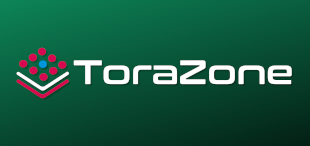

# ToraZone - Experimental Embedded Linux OS

    

ToraZone aims to be as experimental as possible. But at the same time it will be compatible, as far as possible, with Toradex's Torizon ecosystem.

> ⚠️ **IT IS EXTREMELY IMPORTANT TO NOTE THAT THIS PROJECT HAS NO LINK WITH ANY OFFICIAL TORADEX PRODUCT. ALL EXPERIMENTS SHARED HERE ARE “AS IS” WITHOUT WARRANTY OF ANY KIND.**

## Features

- **Debian Based**: ToraZone will be based on Debian. This will make it easier to use existing Debian packages, and make it easier than building with Yocto.
- **Containerized**: ToraZone will run all applications in containers. This will make it easier to manage and update applications.
- **Torizon Compatible**: ToraZone will be compatible with Toradex's Torizon ecosystem. This will allow you to use TorizonCore and Torizon OTA with ToraZone.

## Experimental Features

- **Quecto**: Instead of using Yocto, ToraZone will be built with https://gitlab.com/quectoproject
- **Easy Splash Screen**: Integrate with https://github.com/OSSystems/EasySplash
